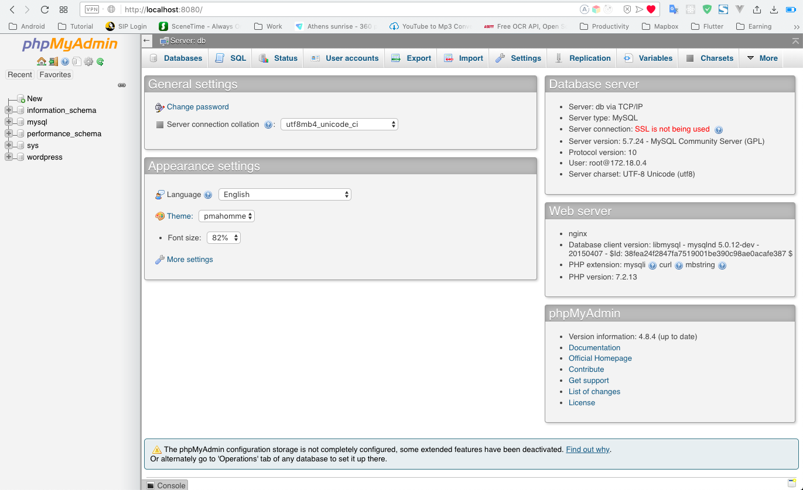
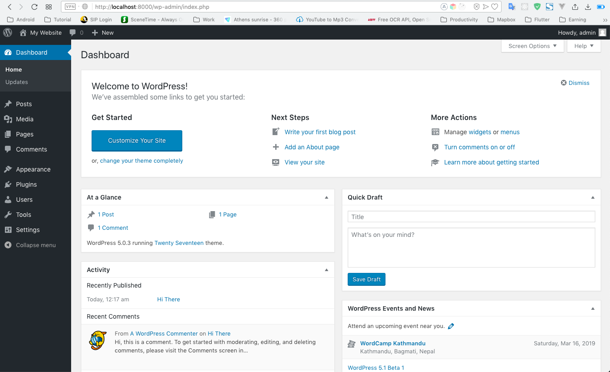

# Wordpress Docker

Overall Setup for Wordpress inside Docer Containers.

The Compose file has the following setup:

1. Wordpress:Latest
2. MySQL
3. PHPMYADMIN for accessing Database

Below are the snapshots of the Setup Wordpress site with Twenty Seventeen theme.

- Snap 1: Running Wordpress Site
  

- Snap 1: Running PhpMyAdmin Site
  

- Snap 1: Running Dashboard Wordpress
  

Cheers.🍺 - Keep Coding 🤟 ⚡ ️
